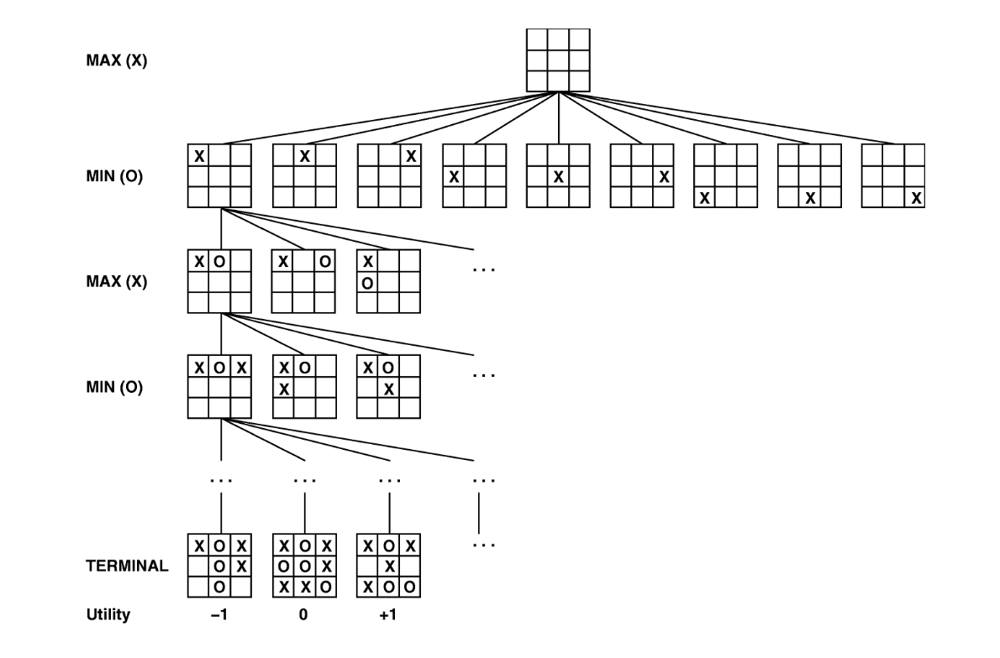
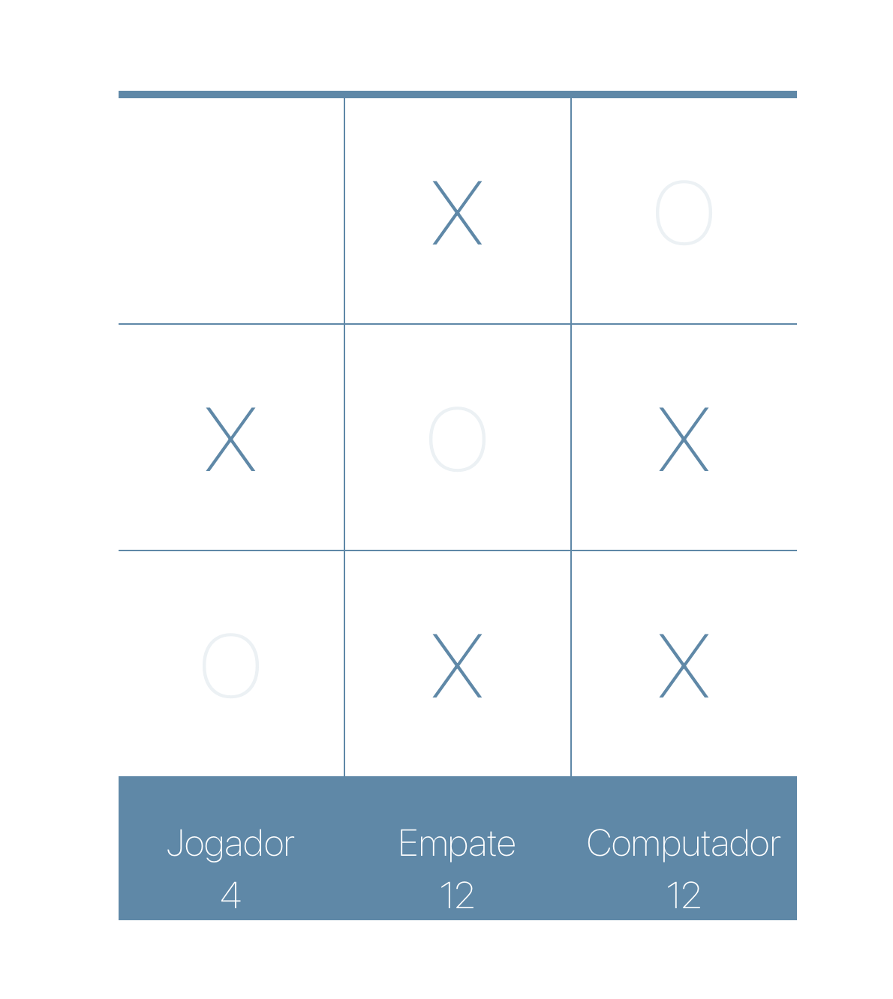
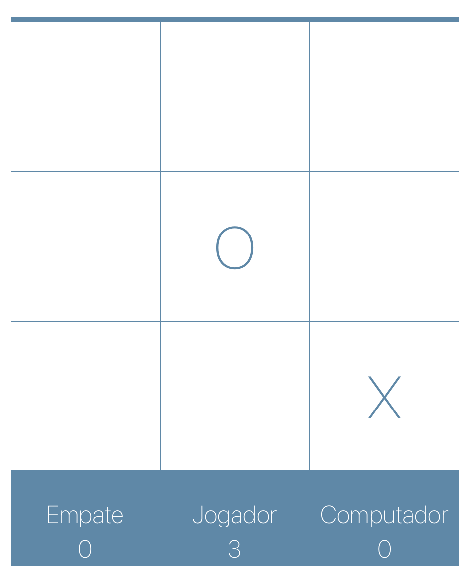
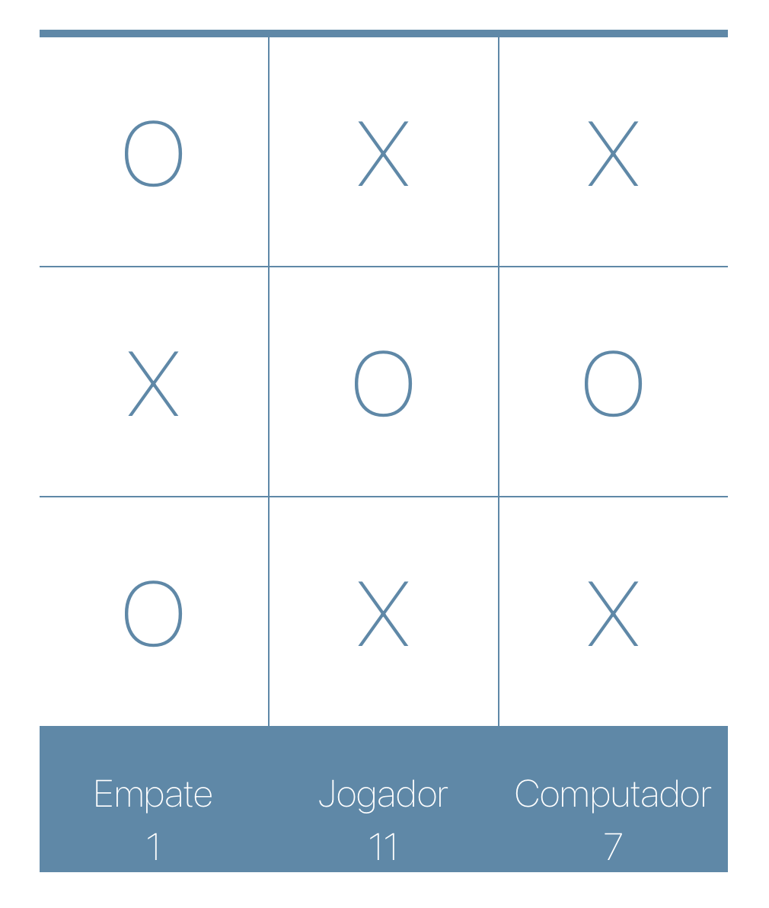

# Jogo da Velha

**Número da Lista**: 1<br>
**Conteúdo da Disciplina**: Grafos 1<br>

## Alunos
|Matrícula | Aluno |
| -- | -- |
| 18/0103792 |Júlia Farias Sousa|
| 18/0078640 |Yuri Alves Bacarias|

## Sobre 
O objetivo do projeto é trabalhar Grafos utilizando o algoritmo Minimax. Note que jogar uma partida de jogo da velha nada mais é do que percorrer um caminho em um grafo (árvore), até se chegar a uma configuração com um vencedor ou a um empate.




Conforme demonstrado na imagem acima, o resultado (Terminal) pode ser -1 (Perder), 0 (Empatar) ou 1 (Ganhar). Basta a inteligência artificial seguir caminhos que o levam para um +1 que terá uma vitória certeira.

Para isso, precisamos de alguma maneira informar o nosso agente qual o caminho mais seguro. E aí entra o papel do Algoritmo Minimax.

O princípio do Minimax é descer os ‘nós’ da Game Tree até chegar no término do jogo, identificando se o jogador perdeu, empatou ou ganhou.

Após isso, o algoritmo sobe um ‘nó’ e identifica de quem é o turno (jogador ou oponente). Caso for o turno do oponente, o algoritmo guarda o menor (Min) resultado de suas respectivas ramificações.

Caso for o turno do jogador, o algoritmo guarda o maior (Max) resultado de suas respectivas ramificações.

Este processo se repete até chegar no primeiro ‘nó’ da Árvore.

Isso significa que, caso a decisão do jogador ganhar ou perder esteja nas mãos do oponente, o Minimax atribui como não sendo seguro entrar por este caminho, indicando somente como ‘1’ os caminhos em que o jogador possa vencer a partida mesmo que o oponente jogue da melhor forma possível.

Neste trabalho podemos identificar o algoritmo minimax no arquivo **Tabuleiro.jsx**
```bash
function Tabuleiro({ setPontuacao }) {
  const [no, setNo] = useState({});
  const [tabuleiro, setTabuleiro] = useState(Array(9).fill(""));
  const [linha, setLinha] = useState([]);

  const resetarJogo = () => {
    setLinha([]);
    setTabuleiro(Array(9).fill(""));
  };

  const getJogadasPossiveis = (tabuleiro) => {
    const movimento = [];
    tabuleiro.forEach((celula, index) => {
      if (!celula) movimento.push(index);
    });
    return movimento;
  };

  const handleClick = (id) => {
    if (
      isTerminal(tabuleiro).vencedor === "X" ||
      isTerminal(tabuleiro).vecedor === "O" ||
      isCheio(tabuleiro)
    ) {
      resetarJogo();
      return;
    }

    if (tabuleiro[id] !== "") return;

    let tabuleiroEditado = [...tabuleiro];
    tabuleiroEditado[id] = "X";

    setTabuleiro(tabuleiroEditado);

    if (isTerminal(tabuleiroEditado).vencedor === "X") {
      console.log(isTerminal(tabuleiroEditado));
      setLinha(isTerminal(tabuleiroEditado).linha);
      setPontuacao((anterior) => ({ ...anterior, empate: anterior.empate + 1 }));
      return;
    }

    let numeroAtual = getMelhorJogada(tabuleiroEditado, 0, false);
    if (tabuleiroEditado[numeroAtual] === "") {
        tabuleiroEditado[numeroAtual] = "O";
    }

    setTabuleiro(tabuleiroEditado);

    if (isTerminal(tabuleiroEditado).vencedor === "O") {
      setLinha(isTerminal(tabuleiroEditado).linha);
      setPontuacao((anterior) => ({ ...anterior, o: anterior.o + 1 }));
      return;
    }

    if (isTerminal(tabuleiroEditado).vencedor === "Desenho") {
      setPontuacao((anterior) => ({ ...anterior, x: anterior.x + 1 }));
    }
  };

  const isVazio = (tabuleiro) => {
    return tabuleiro.every((celula) => !celula);
  };

  const isCheio = (tabuleiro) => {
    return tabuleiro.every((celula) => celula);
  };

  const isTerminal = (tabuleiro) => {
    if (isVazio(tabuleiro)) return false;

    if (tabuleiro[0] === tabuleiro[1] && tabuleiro[0] === tabuleiro[2] && tabuleiro[0]) {
      return { vencedor: tabuleiro[0], linha: [0, 1, 2] };
    }
    if (tabuleiro[3] === tabuleiro[4] && tabuleiro[3] === tabuleiro[5] && tabuleiro[3]) {
      return { vencedor: tabuleiro[3], linha: [3, 4, 5] };
    }
    if (tabuleiro[6] === tabuleiro[7] && tabuleiro[6] === tabuleiro[8] && tabuleiro[6]) {
      return { vencedor: tabuleiro[6], linha: [6, 7, 8] };
    }

    if (tabuleiro[0] === tabuleiro[3] && tabuleiro[0] === tabuleiro[6] && tabuleiro[0]) {
      return { vencedor: tabuleiro[0], linha: [0, 3, 6] };
    }
    if (tabuleiro[1] === tabuleiro[4] && tabuleiro[1] === tabuleiro[7] && tabuleiro[1]) {
      return { vencedor: tabuleiro[1], linha: [1, 4, 7] };
    }
    if (tabuleiro[2] === tabuleiro[5] && tabuleiro[2] === tabuleiro[8] && tabuleiro[2]) {
      return { vencedor: tabuleiro[2], linha: [2, 5, 8] };
    }

    if (tabuleiro[0] === tabuleiro[4] && tabuleiro[0] === tabuleiro[8] && tabuleiro[0]) {
      return { vencedor: tabuleiro[0], linha: [0, 4, 8] };
    }
    if (tabuleiro[2] === tabuleiro[4] && tabuleiro[2] === tabuleiro[6] && tabuleiro[2]) {
      return { vencedor: tabuleiro[2], linha: [2, 4, 6] };
    }

    if (isCheio(tabuleiro)) {
      return { vencedor: "Desenho" };
    }

    return false;
  };

  const getMelhorJogada = (newtabuleiro, depth, isMax, callback = () => {}) => {
    if (depth === 0) setNo({});

    if (isTerminal(newtabuleiro) || depth === -1) {
      if (isTerminal(newtabuleiro).vencedor === "X") {
        return 100 - depth;
      } else if (isTerminal(newtabuleiro).vencedor === "O") {
        return -100 + depth;
      }
      return 0;
    }

    if (isMax) {
      let melhor = -100;

      getJogadasPossiveis(newtabuleiro).forEach((index) => {
        let filho = [...newtabuleiro];
        filho[index] = "X";

        let pontuacao = getMelhorJogada(filho, depth + 1, false, callback);
        melhor = Math.max(melhor, pontuacao);
      });

      return melhor;
    }

    if (!isMax) {
      let melhor = 100;

      getJogadasPossiveis(newtabuleiro).forEach((index) => {
        let filho = [...newtabuleiro];
        filho[index] = "O";

        let pontuacao = getMelhorJogada(filho, depth + 1, true, callback);
        melhor = Math.min(melhor, pontuacao);

        if (depth === 0) {
          console.log(no);
          const jogadas = no[pontuacao] ? `${no[pontuacao]},${index}` : index;
          no[pontuacao] = jogadas;
        }
      });
      if (depth === 0) {
        let returnValor;

        if (typeof no[melhor] === "String") {
          const arr = no[melhor].split(",");
          const rand = Math.floor(Math.random() * arr.length);
          returnValor = arr[rand];
        } else {
          returnValor = no[melhor];
        }

        callback(returnValor);
        return returnValor;
      }
      return melhor;
    }
  };

```


## Screenshots
Interface do Jogo




## Instalação 
**Linguagem**: Javascript<br>
**Framework**: ReactJS<br>
**Instalação**:Node<br>

## Como compilar o jogo

 **Clone o repositório**
 ```bash
 git clone git@github.com:projeto-de-algoritmos/Grafos1_Jogo-da-Velha.git
 ```

 **Instale o npm e compile o código
```bash
   npm install download
   npm install
   npm start
```
## Referências
https://www.organicadigital.com/blog/algoritmo-minimax-introducao-a-inteligencia-artificial/
https://www.lume.ufrgs.br/bitstream/handle/10183/218630/001123316.pdf?sequence=1


